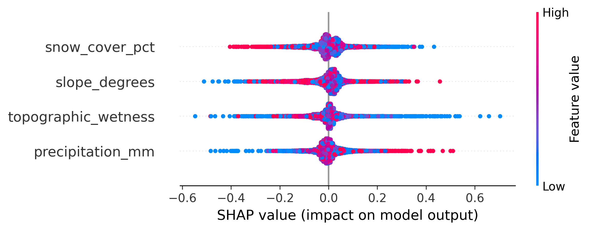

# HydraXAI: Explainable Climate-Aware Flood Risk Intelligence

HydraXAI is a research-grade intelligence framework designed to provide explainable flood risk assessments for the Western Ghats region. By integrating multi-source satellite data with game-theoretic interpretability models, HydraXAI moves beyond "black-box" predictions to offer actionable, physically grounded insights for disaster risk reduction.

## Research Methodology
- **Data Ingestion:** Automated multi-source pipelines for MODIS, SRTM, and climate datasets.
- **Spatial Validation:** Implements custom spatial block cross-validation to mitigate spatial autocorrelation and ensure true geographic generalization.
- **Explainability (XAI):** Employs TreeSHAP to quantify the influence of individual topographical and meteorological triggers on flood hazard probability.

## Key Findings (Feature Attribution)
The framework identifies high-slope intersections and topographical moisture as primary drivers of regional flood risk. The visualization below depicts the global feature attribution audit trail:

## Research Status
- [x] Data Ingestion Pipelines
- [x] Spatial Autocorrelation Mitigation (Block K-Fold)
- [x] TreeSHAP Explainability Module
- [ ] Final Academic Documentation